# Mathias Vite React Template 

## activate Actions 
- go to settings 
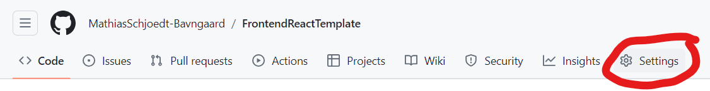
- go to Actions
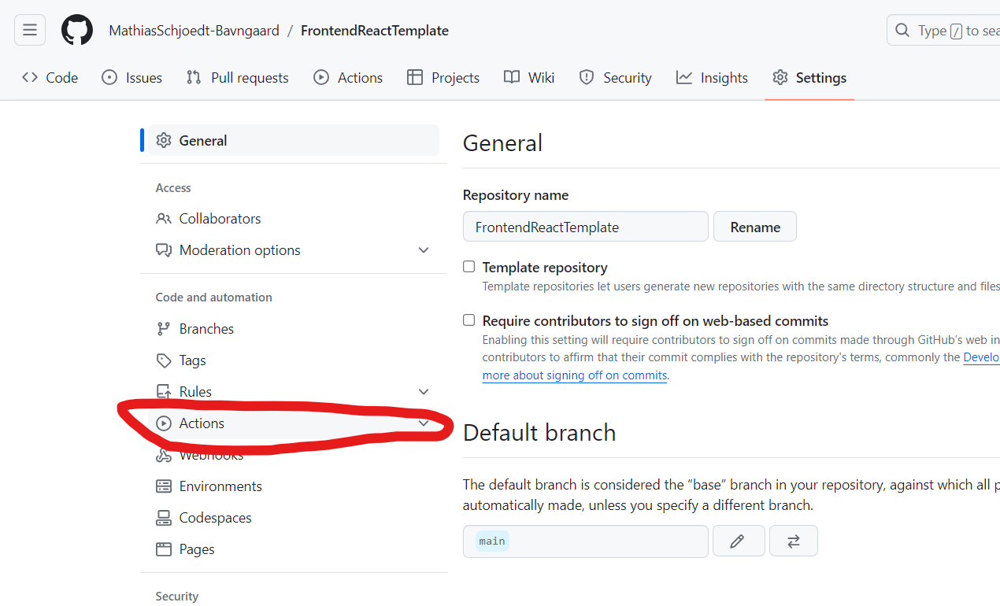
- enable Actions and write permission
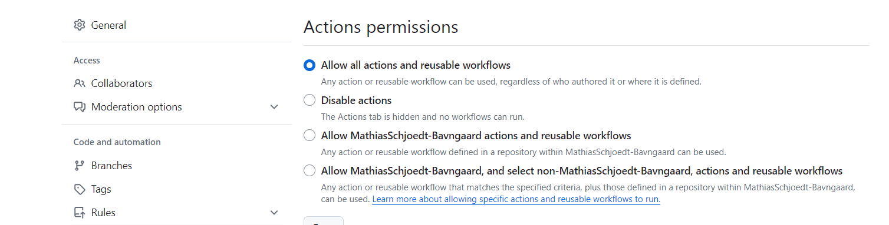
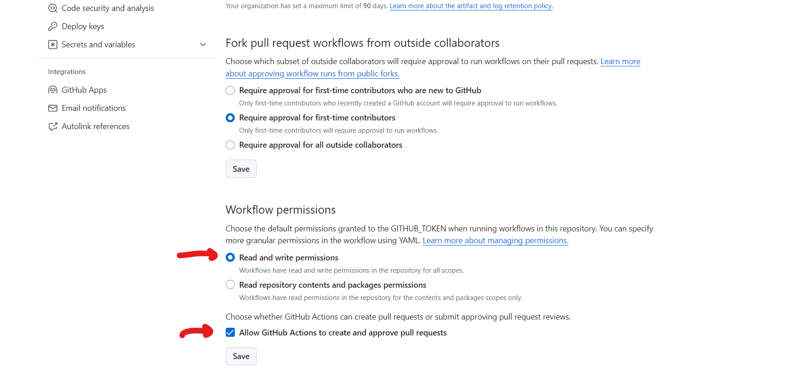

## Activate Pages
- go to settings
- go to Pages
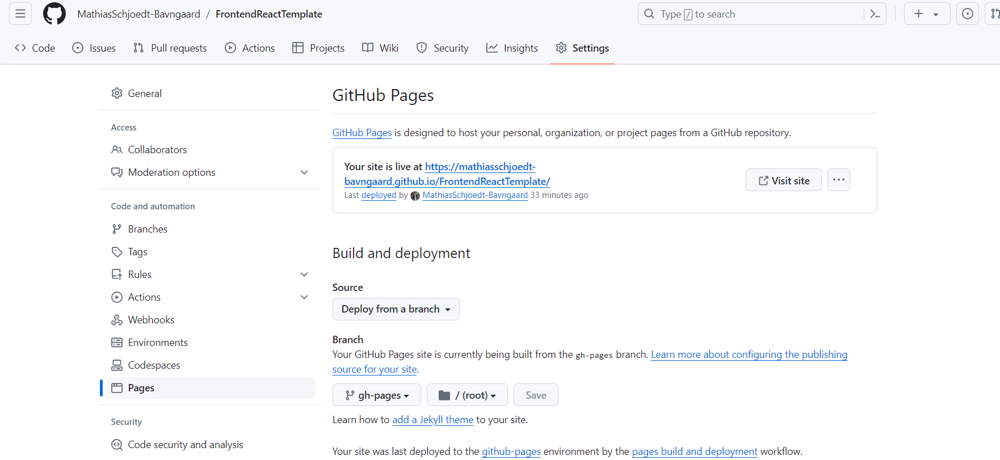
- set deploy from branch
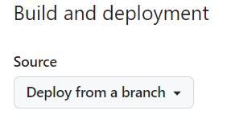
- set Page source to gh-pages branch
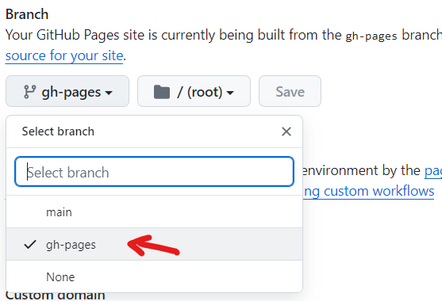

## Enjure that Actions is Running
- go to Actions
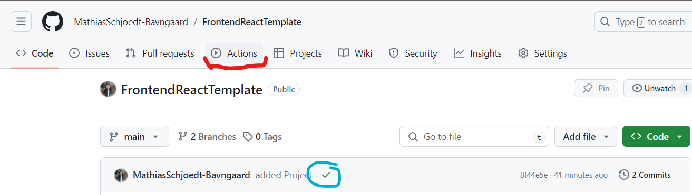
- see that 2 actions are running
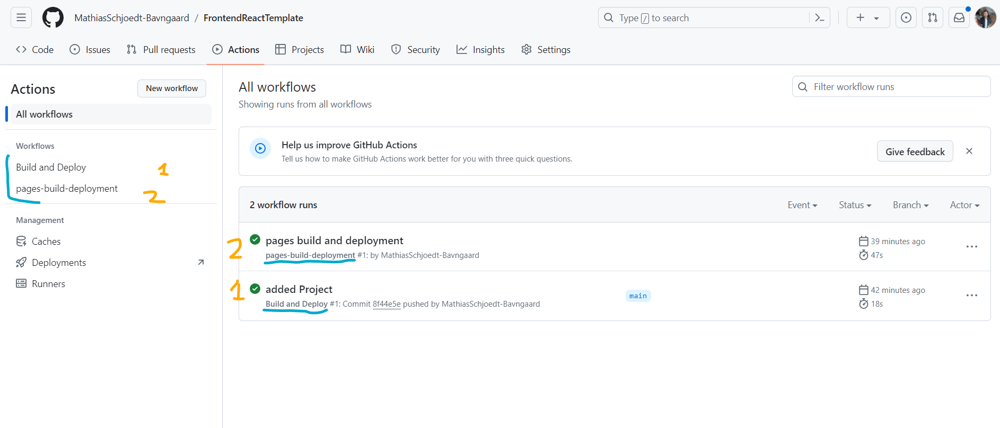

## see your page

- go to settings 
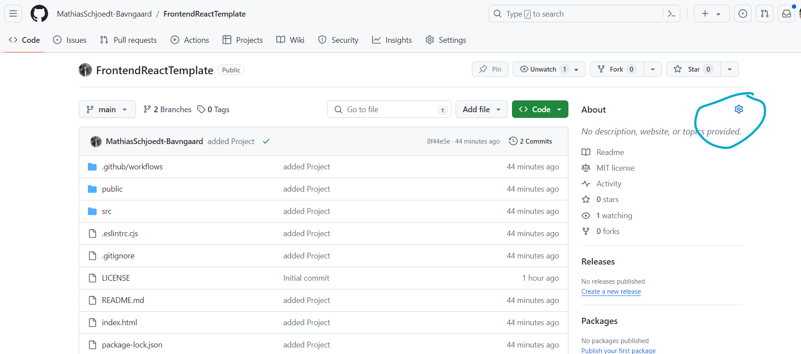
- click use your GithubPages website
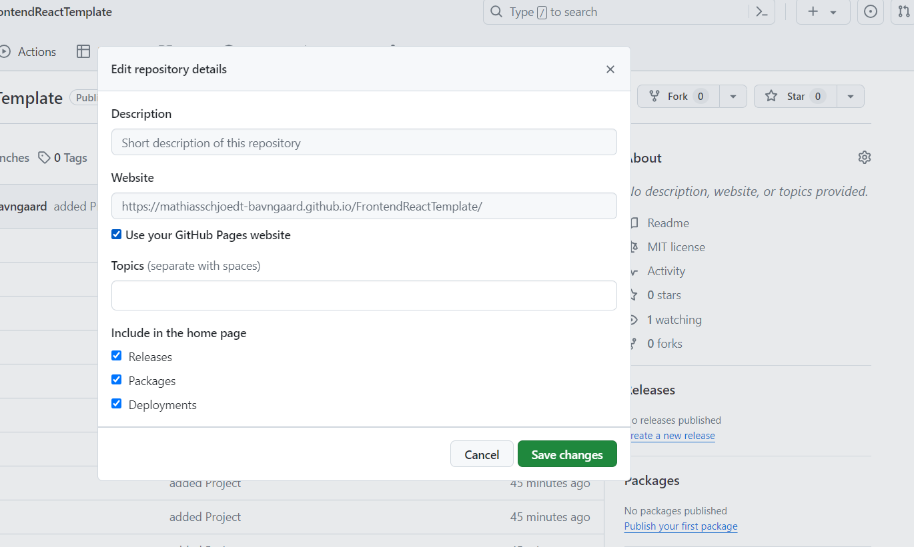

# React + Vite

This template provides a minimal setup to get React working in Vite with HMR and some ESLint rules.

Currently, two official plugins are available:

- [@vitejs/plugin-react](https://github.com/vitejs/vite-plugin-react/blob/main/packages/plugin-react/README.md) uses [Babel](https://babeljs.io/) for Fast Refresh
- [@vitejs/plugin-react-swc](https://github.com/vitejs/vite-plugin-react-swc) uses [SWC](https://swc.rs/) for Fast Refresh
